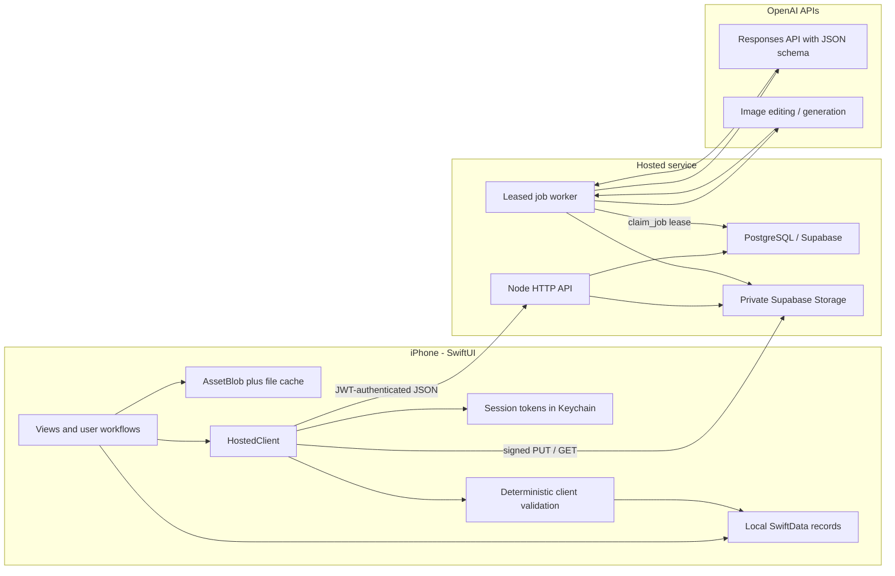
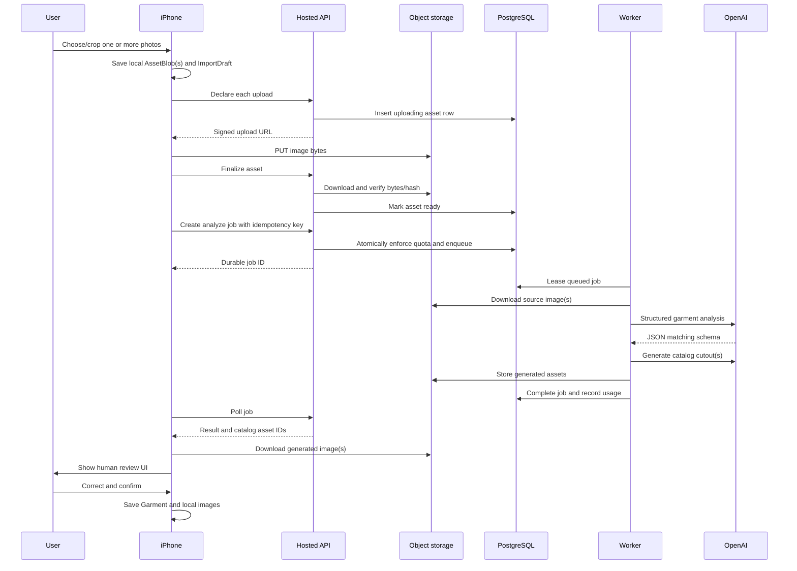

# Wearwell Technical Design and Engineering Guide

**Document status:** Living design document  
**Code snapshot:** `codex/hosted-multiuser` working tree  
**Last audited:** 2026-08-05  
**Primary audience:** New engineers learning the product, especially engineers new to iOS, backend systems, and production foundation-model applications

This document explains how Wearwell works, why its major design decisions were made, and which parts of the hosted migration are complete or still in progress. It is intentionally more educational than a normal design document. When the product changes, update this file in the same pull request as the code.

> Important: the repository is in the middle of a migration from a paired Mac companion to a hosted multi-user service. This document describes the current working tree, not only the last commit. Sections labeled **In progress** identify code that exists on one side of the system but is not wired end to end yet.

## 1. Executive summary

Wearwell is a native iPhone wardrobe application. A user catalogs clothes, builds editable outfit collages, saves inspiration looks, asks AI for outfit suggestions, and tests prospective purchases against clothes they already own.

The system has three major runtime layers:

1. **The iOS application** owns the interactive product, a local SwiftData database, offline-readable records, and local image persistence.
2. **The hosted API** authenticates users, enforces invitations and quotas, issues signed object-storage URLs, stores multi-user records, and creates durable AI jobs.
3. **The hosted worker** leases jobs from PostgreSQL, calls OpenAI models, stores results and generated images, records usage, and retries transient failures.

The most important design principle is:

> A model call is an unreliable subsystem, not the product. Deterministic software must control identity, persistence, permissions, validation, retries, and final user-visible state.

Manual collages remain local. AI work requires an authenticated hosted account and network connection. The hosted migration replaces the earlier `codex login` plus six-digit phone-to-Mac pairing architecture; that pairing flow is no longer part of the current runtime.

## 2. Architecture



### Why this shape?

The original architecture ran AI on a paired Mac using the Mac's Codex login. That avoided shipping an API key but required the Mac to be installed, awake, reachable, and paired. It was a good personal-development architecture, but it did not naturally support multiple users.

The hosted design moves responsibility to centrally operated infrastructure:

- Users authenticate with Supabase Auth.
- The iPhone contains only public environment configuration and user session tokens.
- The OpenAI API key and Supabase service-role key remain server-side.
- PostgreSQL supplies durable multi-user job and record storage.
- Private object storage holds uploaded and generated images.
- Separate API and worker processes allow web requests to stay short while AI work continues asynchronously.

The cost is additional operational responsibility: deployments, secrets, database migrations, storage lifecycle, quotas, monitoring, account deletion, and incident response now belong to the service owner.

## 3. Repository map

| Path | Responsibility |
| --- | --- |
| `Wearwell/Models/Models.swift` | iOS domain model and persisted SwiftData types |
| `Wearwell/Views/` | SwiftUI product surfaces and feature orchestration |
| `Wearwell/Services/HostedClient.swift` | Authentication-facing client, uploads, API calls, job polling, downloads |
| `Wearwell/Services/APIContracts.swift` | Shared iOS wire-result types |
| `Wearwell/Services/AssetStore.swift` | Local image persistence, cache materialization, cutout cleanup, validation |
| `Wearwell/Services/StylePreferenceCache.swift` | Interpretable style-profile aggregation and relevance scoring |
| `Wearwell/Services/OutfitFeedbackStore.swift` | Local likes, dislikes, reasons, and outfit-edit feedback |
| `Wearwell/Services/BackupService.swift` | Versioned local backup package and non-destructive restore |
| `Backend/server.mjs` | Authenticated HTTP API and route handlers |
| `Backend/worker.mjs` | Durable job leasing, heartbeats, retries, usage recording, account purge |
| `Backend/workflows.mjs` | AI workflow prompts, model calls, and result assembly |
| `Backend/openai-service.mjs` | OpenAI Responses and Images API adapter |
| `Backend/supabase/migrations/` | PostgreSQL schema, RLS, stored functions, queues, quotas, and sync log |
| `Backend/storage.mjs` | Private object-storage adapter and upload validation |
| `render.yaml` | Staging API and worker deployment declaration |
| `Config/Hosted.example.xcconfig` | Public iOS hosted-environment configuration template |
| `WearwellTests/` and `Backend/tests/` | Swift and Node contract/regression tests |

Some renamed `Backend` modules such as the old in-memory priority queue and serial queue remain from the companion implementation. The hosted worker uses PostgreSQL leasing instead of those process-local queues.

## 4. Vocabulary

- **SwiftUI:** Apple's declarative UI framework. A view describes what the UI should look like for current state.
- **SwiftData:** Apple's object-persistence framework. `@Model` objects are stored in a local database and observed by SwiftUI.
- **PostgreSQL:** the hosted relational database used for accounts, records, jobs, quotas, and synchronization metadata.
- **Supabase:** provides authentication, PostgreSQL hosting conventions, and private object storage.
- **JWT:** a signed token containing user identity and session claims. The backend verifies it before accepting a request.
- **RLS:** PostgreSQL Row Level Security. It restricts which rows a database role can access based on the authenticated user.
- **Signed URL:** a temporary URL granting permission for one object-storage upload or download without exposing the service-role key.
- **Idempotency:** retrying the same logical operation does not create a second operation.
- **Lease:** temporary ownership of a job by one worker. If the worker dies and stops renewing the lease, another worker can recover it.
- **Structured output:** model output constrained to a JSON schema rather than unstructured prose.
- **Embedding:** usually a learned high-dimensional vector. Wearwell's style vector is embedding-like, but is a manually defined, interpretable feature vector rather than a learned embedding.
- **Source of truth:** the authoritative representation from which caches or projections can be rebuilt.

## 5. iOS application lifecycle

`WearwellApp.swift` creates the root dependencies:

- A persistent `ModelContainer` using `WearwellSchemaV1`.
- `HostedClient` for hosted API work.
- `HostedAuthController` for Apple and email authentication.
- `DataProtectionController` for local image-store initialization and legacy migration.

They are injected as SwiftUI environment objects. This is lightweight dependency injection: screens share one authenticated client and one storage controller rather than constructing new instances independently.

The local SwiftData configuration currently uses `cloudKitDatabase: .none`. Therefore local records are not automatically mirrored through CloudKit in this branch.

`RootTabView` exposes five product areas:

1. Wardrobe
2. Outfit Studio
3. Inspiration
4. Buy?
5. Add Clothes

SwiftUI-specific properties used throughout the app include:

- `@State`: temporary state owned by a view, such as an open sheet or text field.
- `@Binding`: state owned by a parent and edited by a child.
- `@EnvironmentObject`: a shared long-lived dependency.
- `@Environment(\.modelContext)`: the current SwiftData transaction context.
- `@Query`: a live query that refreshes the view when persistent records change.
- `@Bindable`: editable access to a SwiftData model.

SwiftUI view values may be recreated frequently. Durable user operations must therefore be stored in models such as `ImportDraft` and `StyleGeneration`, not only in `@State` booleans.

## 6. Local persistence and data model

### 6.1 SwiftData container and schema

`WearwellSchemaV1` lists every persistent model. The explicit `VersionedSchema` is the starting point for future migrations. Adding or changing persistent fields eventually requires a new schema version and a migration plan; relying indefinitely on lightweight inference is risky once users have irreplaceable data.

The main models are:

| Model | Meaning |
| --- | --- |
| `Garment` | An owned clothing item and its model/user metadata |
| `WishlistItem` | A prospective purchase and its assessment state |
| `Outfit` | An editable collage and its origin |
| `Visualization` | A generated mannequin or on-person image |
| `ReferencePhoto` | A user or mannequin reference image |
| `ImportDraft` | A durable phone-side garment-analysis operation |
| `StyleGeneration` | A durable phone-side styling operation |
| `InspirationLook` | One inspiration image and cached analysis |
| `StyleProfile` | Aggregated reusable style representation |
| `AssetBlob` | Durable local image bytes |

### 6.2 Garment evidence and uncertainty

A `Garment` stores user-visible fields plus model provenance:

- category and optional subcategory
- color and description
- `observed`: facts directly supported by the image
- `unknowns`: details the model could not establish
- confidence
- fingerprint for likely-duplicate detection
- source and catalog asset names
- model and prompt versions

Separating observations from unknowns is a deliberate ML reliability decision. Without it, generated prose tends to blur visual evidence and guesses. Model and prompt versions make behavior traceable after upgrades.

The category/subcategory relationship is enforced by computed setters and UI pickers. The hosted backend contains a matching taxonomy. This duplication protects both boundaries but creates a schema-drift risk; a shared generated contract would eventually be safer.

### 6.3 JSON stored inside models

Complex values such as layouts, analyses, suggestions, and style profiles are encoded as JSON `Data` fields.

Advantages:

- Direct use of Swift `Codable` types.
- Easy atomic replacement of one whole model result.
- Fewer SwiftData relationship types.
- Convenient preservation of wire responses.

Costs:

- Individual JSON properties cannot be efficiently queried or indexed by SwiftData.
- Decode failures often degrade to empty arrays because the code uses `try?`.
- Schema evolution of nested values must be handled manually.
- Partial updates rewrite the entire JSON value.

This is reasonable for small, mostly read-as-a-whole structures. Frequently queried properties should become normal columns or related models.

### 6.4 Outfit layout

`LayoutItem` stores a reference plus normalized position, scale, rotation, and z-index. Normalized positions make a saved layout independent of a particular device size.

`OutfitLayout.arranged` deterministically creates a low-overlap grid. AI chooses garment IDs; deterministic code chooses initial geometry. Asking a language model for pixel-perfect layout would add variability without useful intelligence.

Purchase-test outfits keep the candidate separate from owned IDs. The candidate is referenced by `wishlistItemID`, while owned pieces use `garmentID`. When the user marks the item purchased, the app creates a `Garment` and rewrites candidate layout references to the new owned garment ID.

## 7. Local image persistence and cleanup

`AssetStore` is a Swift `actor`, which serializes access to mutable image-storage state and prevents data races.

The local image design has two layers:

1. `AssetBlob` in SwiftData stores durable bytes.
2. `WearwellAssets` is a rebuildable filesystem cache used for fast image rendering.

`AssetCacheHydrator` observes persisted blobs and rematerializes missing cache files. It also removes duplicate blob rows. This separates durability from rendering performance.

The image pipeline contains several deterministic repair stages around Apple Vision segmentation:

- embedded checkerboard detection and cleanup
- real-alpha detection
- foreground-subject extraction
- crop validation
- chroma-backdrop removal
- alpha-bound cropping

These stages exist because model-generated catalog assets can contain fake transparency, green/colored backdrops, clipped garments, or enclosed lace/mesh holes. Alpha-based cropping avoids deleting white clothing, which a color-keying algorithm might mistake for background.

The rule is the same as elsewhere in the system: use ML for perception or generation, then use deterministic code for known constraints and failure modes.

## 8. Hosted configuration and secret boundaries

The iOS build reads three public values from `Info.plist`, normally supplied by an untracked xcconfig:

- API base URL
- Supabase URL
- Supabase anonymous key

The Supabase anonymous key is public by design. It is not equivalent to the service-role key.

Server-only environment variables include:

- `DATABASE_URL`
- `SUPABASE_SERVICE_ROLE_KEY`
- `OPENAI_API_KEY`
- text and image model names
- worker concurrency and lease duration

`loadConfig` fails closed when required secrets are absent. The OpenAI key and Supabase service-role key must never enter the iOS target, repository history, logs, or client configuration.

The API process uses plain Node HTTP because the intended hosting platform terminates public TLS before forwarding traffic to the process. Local direct deployment would need an equivalent TLS boundary.

## 9. Authentication, invitations, and sessions

### 9.1 Sign in with Apple

`HostedAuthController` asks `AuthenticationServices` for an Apple identity token, then exchanges it with Supabase Auth. Supabase returns an access token, refresh token, and user ID.

### 9.2 Email magic link

The client can request an email OTP/magic link from Supabase. The app registers the `wearwell://` URL scheme and parses access and refresh tokens from the callback URL.

### 9.3 Keychain storage

Access token, refresh token, and user ID are stored in the iOS Keychain using `AfterFirstUnlockThisDeviceOnly`.

- Keychain is appropriate for session secrets.
- `ThisDeviceOnly` prevents the tokens from being restored onto a different device through backup.
- `AfterFirstUnlock` permits access after the first device unlock following restart.

### 9.4 Backend JWT verification

The API obtains Supabase's remote JSON Web Key Set and verifies:

- JWT signature
- `authenticated` audience
- presence of a subject/user ID

It never trusts a user ID supplied in the request body. Ownership always comes from the verified token.

### 9.5 Invitation gate

An authenticated Supabase user is not automatically an active Wearwell member. `requireActiveMember` checks `profiles.status == active`.

Invite codes are stored only as SHA-256 hashes. The `redeem_invite` PostgreSQL function locks one matching invite row, checks expiry and use limits, activates the profile, records redemption, and increments usage atomically.

### Current session limitation

The refresh token is stored, but the iOS client does not yet use it to refresh an expired access token. Once the access token expires, API calls can fail as signed out until the user authenticates again. A production session manager should refresh ahead of expiry, serialize concurrent refresh attempts, and retry the original request once.

## 10. Hosted API

`Backend/server.mjs` is a small framework-free Node HTTP server. Every request receives a UUID `requestID`.

Major route groups are:

- `GET /healthz`
- `POST /v1/invites/redeem`
- `GET /v1/sync`
- `GET|PUT|DELETE /v1/data/:resource/:id?`
- `POST /v1/assets/upload`
- `POST /v1/assets/finalize`
- `GET|DELETE /v1/assets/:id`
- `POST /v1/jobs/:kind`
- `GET|DELETE /v1/jobs/:id`
- `GET /v1/usage`
- `POST /v1/backups/import`
- `GET /v1/backups/export`
- `DELETE /v1/account`

Request bodies are size-limited and invalid JSON returns a controlled `400`. Responses disable caching and MIME sniffing.

The API queries always include `owner_id` for user data. The service-role database/storage client is powerful enough to bypass ordinary client RLS, so these explicit ownership checks are security-critical.

## 11. Hosted PostgreSQL model

### 11.1 Profiles and invitations

`profiles` stores membership state and monthly analysis, style, image, and storage limits. Invitation tables separate code configuration from redemption history.

### 11.2 Generic domain-record tables

Garments, outfits, wishlist items, inspiration, and other domains use similarly shaped tables:

- UUID primary key
- owner ID
- monotonically increasing revision
- JSONB `data`
- created/updated timestamps
- soft-delete timestamp

Why JSONB here?

- It accelerates the hosted migration by allowing existing Codable-shaped records to move without a fully normalized server schema.
- Generic API and sync logic can work across many resource types.
- The client can evolve record payloads with fewer SQL migrations.

Tradeoffs:

- PostgreSQL cannot enforce most domain invariants inside `data`.
- Querying wardrobe attributes is harder and less index-friendly.
- Analytics and migrations require JSON-aware code.
- Invalid shapes can enter unless API validation is comprehensive.

### 11.3 Optimistic concurrency

Each record has a revision. A `PUT` includes the client's expected revision. The update succeeds only if the stored revision still matches; otherwise the server returns `409 revision_conflict`.

This is optimistic concurrency control. It assumes conflicts are uncommon and detects them rather than locking a record for the entire editing session.

### 11.4 Soft deletion and change feed

Deletes set `deleted_at` and increment the revision. Triggers append an `upsert` or `delete` event to `sync_changes` with a global sequence number.

`GET /v1/sync?cursor=N` returns up to 500 changes after a cursor plus current data for non-delete changes. The client can advance the cursor and request additional pages while `hasMore` is true.

### 11.5 Row Level Security

RLS is enabled on user tables. Policies permit authenticated users to select their own rows. Mutations and privileged stored functions are performed by the backend's service role, and direct execution of quota, invite, claim, usage, and purge functions is revoked from normal users.

RLS is defense in depth; it does not remove the need for owner-filtered API queries.

### Hosted sync status: in progress

The server-side data and change-feed endpoints exist, but `HostedClient` does not currently call `/v1/sync` or `/v1/data`. The active iOS product still uses local SwiftData as its domain-record source of truth and primarily uses the hosted service for auth, AI jobs, asset transfer, quotas, and backup import.

Therefore claims such as “records are synced across devices” are architectural intent, not complete current behavior. A future sync engine must define serialization, revision tracking, conflict UI, tombstone handling, asset-ID mapping, initial bootstrap, offline writes, and cursor persistence.

## 12. Private object storage

Images are not sent through PostgreSQL JSON. They live in the private `wearwell-assets` Supabase Storage bucket.

### Upload protocol

1. The iPhone hashes the bytes with SHA-256.
2. It declares MIME type, byte count, hash, and asset kind to the API.
3. The API checks MIME type, the 18 MB size limit, hash format, and user storage quota.
4. The API inserts an `uploading` asset row and creates an owner-scoped storage path.
5. The API returns a signed upload URL.
6. The iPhone uploads bytes directly to object storage.
7. The iPhone calls `finalize`.
8. The API downloads the object and verifies actual length and SHA-256.
9. A matching object becomes `ready`; a mismatch is deleted.

This keeps large bytes away from the API process while preventing a client from lying about quota usage or content identity.

### Download protocol

The API verifies asset ownership and returns a signed download URL that expires after five minutes. The phone downloads directly from object storage.

### Generated assets

The worker uploads generated PNG bytes with a server-created UUID and inserts a ready asset row. Job results contain the generated asset ID rather than base64 image bytes. The iPhone downloads the asset and stores a local copy through `AssetStore`.

### Current storage lifecycle limitations

- Re-uploading the same local visual reference currently creates another remote asset; SHA-256 is validated but not used for owner-level deduplication.
- AI requests can repeatedly upload wardrobe/inspiration images.
- Source and visual-reference asset cleanup is not yet clearly tied to local deletion or job completion.
- The iPhone labels all uploaded `Data` as JPEG even when the bytes may be PNG; MIME detection should eventually use the actual file type.

These affect quota correctness and long-term storage cost.

## 13. Durable job system

AI work is asynchronous because analysis and image generation can outlive an HTTP request or phone foreground session.

### 13.1 Creation and idempotency

The client creates a random `Idempotency-Key`. PostgreSQL enforces uniqueness per owner. If the same logical create request is retried with the same key, `create_job_with_quota` returns the existing job.

The stored function checks the active profile and monthly quota inside the same database operation as job creation. This avoids two concurrent requests both passing a non-atomic “check then insert.”

Current quotas count created jobs during the month, including jobs that later fail. `usage_ledger` separately records actual model usage after successful completion.

### 13.2 Queue claiming

Workers call `claim_job`. PostgreSQL uses `FOR UPDATE SKIP LOCKED` to ensure multiple workers do not claim the same row while still allowing them to claim different rows concurrently.

The selected job changes from `queued` to `processing`, receives a lease owner, increments its attempt count, and receives a lease expiry.

### 13.3 Lease and heartbeat

While work runs, the worker periodically extends the lease. If the row is no longer processing, the lease owner changed, or cancellation was requested, the heartbeat aborts the model operation.

If a worker crashes, its lease eventually expires. A later `claim_job` resets expired processing jobs to queued with the stage “Recovered after worker restart.”

This is more robust than an in-memory queue because process restarts do not erase the work list.

### 13.4 Completion, usage, and retry

On success the worker transaction:

- marks the job complete
- stores the result
- stores model version and latency
- stores normalized usage
- clears the lease
- inserts one usage-ledger record

On failure, messages matching rate limits, timeouts, temporary failures, connection resets, or 5xx errors are treated as transient. They retry up to three attempts with increasing delay, capped at five minutes. Other failures become terminal.

### 13.5 Cancellation

The API marks active jobs cancelled and records `cancel_requested_at`. The worker observes cancellation through its heartbeat and abort signal.

Cancellation is cooperative, not instantaneous. The completion update should remain guarded by lease/state/cancellation conditions to eliminate a narrow race where a workflow finishes between cancellation and the next heartbeat.

## 14. OpenAI integration

The hosted backend no longer uses `codex login`, the Codex SDK, local `CODEX_HOME`, or phone-to-Mac certificate pairing.

`openai-service.mjs` creates an OpenAI API client using the server-only project key.

### Structured text/model calls

The service uses the Responses API with:

- configured text model
- medium reasoning effort
- `store: false`
- a strict JSON schema
- attached images as data URLs
- a hashed `safety_identifier` derived from the Wearwell user ID
- an abort signal from the job lease/cancellation system

It records input, output, and total token counts plus latency and returned model name.

### Image calls

Catalog cutouts, edits, and visualizations use the Images API with uploaded reference files, high quality, PNG output, and transparent-background preference.

Generated images are approximations. They are not authoritative evidence of fit, drape, opacity, sizing, construction, or exact appearance.

## 15. AI workflows

### 15.1 Garment analysis

Input can be one photo, several separate photos, or several views of the same garment.

For “same item,” the prompt explicitly requests exactly one item from multiple views. Otherwise it inventories deliberately shown clothing and excludes the person, background, bags, and jewelry.

Structured output contains:

- label
- category and subcategory
- color
- confidence
- description
- observed evidence
- unknown details
- fingerprint

For results with confidence at least `0.45`, the worker requests a clean catalog image and stores its asset ID. The user reviews and edits all results before they become garments.

The human review step is important: model output is a draft annotation, not trusted database truth.

### 15.2 Inspiration analysis

Each inspiration image is analyzed into reusable style evidence:

- summary
- aesthetic traits
- palette
- silhouettes
- layering
- details
- occasions
- outfit formula
- proportion relationships
- focal points
- reusable styling rules
- twelve-dimensional style vector

Analysis version 2 added formula, proportion, focal-point, and rule fields. The iOS app detects older analyses and reanalyzes them when hosted AI is available.

### 15.3 Outfit styling: generator plus critic

Styling is a two-model-call pipeline.

The generator receives:

- owned wardrobe records and visual references
- occasion, weather, mood, free-form request, and optional anchor
- aggregate style profile
- inspiration analyses
- recent generated outfits
- explicit likes/dislikes and reasons
- saved outfit examples
- edits the user made to generated outfits

It creates 10–12 candidate outfits using known garment IDs.

A separate critic receives those candidates and selects exactly three. It may rewrite titles and rationales but must not change IDs or layering. This separation lets one pass explore and another pass rank for coherence, distinctness, feedback alignment, and visual plausibility.

The phone applies `OutfitValidator` before exposing results. It rejects unknown IDs, duplicates, invalid category counts, and incomplete two-piece torso layering.

The hosted workflow currently relies mostly on JSON schema before returning results; it does not call the retained backend `hasValidOutfitComposition` helper in the hosted style path. Server-side semantic validation would provide stronger defense in depth.

### 15.4 Purchase assessment

The candidate is represented by the reserved ID `__candidate__`; owned garment arrays may contain only real owned IDs. The model returns a `buy`, `maybe`, or `skip` verdict, summary, and three to five potential outfits.

The client validates every outfit against the owned wardrobe and candidate category before saving purchase-test collages.

### 15.5 Recommend one item inside a collage

The collage editor can ask for one unused owned item from a chosen category or subcategory. The client precomputes eligible items, the backend constrains structured output to those IDs, and the client verifies the returned ID again before adding it.

**In progress:** client, workflow, schemas, and API route recognition include `recommend-item`, but the initial SQL `jobs.kind` check constraint and quota categories do not yet include it. A fresh database using the current migration will reject that job until the migration is updated.

### 15.6 Catalog edit and visualization

Catalog editing uploads one image and a bounded instruction. Visualization uploads a reference plus selected garment images. Both run as durable image jobs, store a generated asset, and return its asset ID.

## 16. Style profile: “embedding” explained precisely

Wearwell's style vector has twelve named dimensions:

- minimal / maximal
- relaxed / tailored
- romantic / edgy
- sporty / vintage
- classic / experimental
- layered / colorful

Each inspiration analysis supplies values from 0 to 1. The local profile computes a weighted mean:

```text
profile_dimension = sum(look_dimension * look_weight) / sum(look_weight)
```

Favorite looks have weight `2`; ordinary looks have weight `1`.

This vector is interpretable and stable, but it is not a neural embedding:

- dimensions were selected by developers
- the vector has semantic labels
- no embedding model learned the coordinate system
- similarity is not currently computed with cosine distance

The profile also aggregates the most frequent normalized textual traits. Favorite examples sort ahead of non-favorites. `relevantLooks` can rank looks by lexical token overlap with a query and then recency, although the current hosted style call passes the view's inspiration collection rather than applying a narrow server-side vector search.

This design prioritizes explainability and debuggability. A later semantic retriever could use learned embeddings, but it would need evaluation to prove it improves style relevance.

## 17. Feedback and personalization

Wearwell learns from several distinct signals:

- Favorite inspiration looks
- Loved generated outfits
- Disliked generated outfits
- Structured dislike reasons such as wrong proportions or bad layering
- Saved outfits
- Garments added or removed when editing a generated collage
- Final positions, scales, rotations, and z-order in edited collages

`OutfitFeedbackStore` currently saves feedback and edit history in `UserDefaults`, capped at 200 rating records and 100 edit records. A combination key is built from sorted garment UUIDs so the same set is recognized regardless of order.

This data is passed back into later styling prompts. It is not yet used to train or fine-tune a model; it is in-context personalization.

The hosted schema contains `outfit_feedback` and `outfit_edits` tables, but the iOS feedback store currently remains local and is not synced through `/v1/data`.

## 18. End-to-end workflows

### 18.1 Clothing import



The phone-side `ImportDraft` remains after app suspension and retries submission when service access returns. It expires unresolved work after 24 hours. The server-side job is independently durable, so the phone does not need to remain awake after job creation.

### 18.2 Outfit request

1. The phone persists a `StyleGeneration` in `submitting` state.
2. It builds context from wardrobe records, images, inspiration, history, ratings, saved outfits, and edits.
3. It uploads visual references and creates a durable `style` job.
4. The worker generates 10–12 candidates.
5. A critic selects three.
6. The phone polls, validates the returned IDs and composition, and persists suggestions.
7. Opening a suggestion creates a deterministic starting layout in the manual editor.
8. Likes, dislikes, and user edits become later prompt context.

### 18.3 Garment image regeneration

The garment detail screen accepts several new views of the same item. It stores pending source information and remote job state on the existing `Garment` itself. The current catalog image remains visible until the new result is complete and accepted. Failure does not destroy the old image.

This is a safe replacement pattern: stage new state, validate it, then swap.

## 19. Backup, migration, and account deletion

### Local backup package

`BackupService` creates a versioned `.wearwellbackup` package containing a manifest and checksummed assets. Restore verifies assets and merges by record ID without erasing unrelated local records. Tests assert non-destructive and idempotent behavior.

### Hosted backup import/export

The hosted API can export JSONB records plus temporary asset download URLs. Import accepts a version-1 manifest, maps local asset names to uploaded hosted asset IDs, and merges supported resources by ID inside a transaction.

The Settings import path currently restores locally first and then uploads/imports to the hosted service.

### Account deletion

Deleting an account:

1. Changes the profile to `deleting`, immediately blocking normal service access.
2. Inserts a deletion request with a seven-day purge deadline.
3. The worker periodically finds due requests.
4. It removes the user's object-storage paths.
5. `purge_account` deletes the Supabase auth user, cascading database records.

This delay permits operational recovery or policy compliance while stopping product access immediately.

## 20. Reliability properties

The design intentionally handles several failure classes:

| Failure | Response |
| --- | --- |
| Phone suspends | Local draft/generation survives; hosted job continues |
| API restarts | Job state remains in PostgreSQL |
| Worker crashes | Lease expires and job returns to queue |
| Temporary OpenAI/network failure | Up to three delayed attempts |
| Duplicate create request | Per-user idempotency key returns existing job |
| Two workers claim concurrently | `FOR UPDATE SKIP LOCKED` gives each a different job |
| Upload lies about size/hash | Finalize downloads, verifies, and deletes mismatch |
| Model returns unknown IDs | JSON enum plus client validation rejects them |
| Generated cutout is poor | Human review and local image cleanup/editing |
| Regeneration fails | Existing garment image remains unchanged |
| Another device changed a record | Revision mismatch returns `409` |
| User goes offline | Existing local SwiftData and images remain readable |

## 21. Security and privacy boundaries

Strong current choices include:

- Server secrets never enter the iOS build.
- User identity comes from a verified JWT, not request data.
- Every database and storage lookup is owner-scoped.
- The storage bucket is private.
- Signed URLs are temporary.
- Upload size and checksum are verified server-side.
- RLS adds database-level isolation.
- Privileged stored functions are restricted to the service role.
- OpenAI requests use `store: false`.
- A pseudonymous safety identifier is hashed from the user ID.
- Account deletion schedules database and object purge.
- AI input is limited to images the user selects for a feature.

Areas requiring ongoing scrutiny:

- Access-token refresh and revocation behavior.
- Validation of backup JSON shapes before inserting JSONB.
- Remote asset garbage collection and deduplication.
- Avoiding sensitive prompt or image data in logs.
- Ensuring every new route filters by verified owner.
- Rate limiting beyond monthly quotas.
- Abuse prevention for invitation redemption and large job creation.
- Ensuring account purge succeeds despite partial storage failures.
- Security review of callback URLs and email-auth redirect configuration.

## 22. Logging, metrics, and observability

Current observability is minimal but has useful foundations:

- Every API request receives a UUID request ID.
- Controlled error responses return that request ID.
- Server 5xx errors are logged as JSON with request ID and message.
- API startup logs environment and port.
- Worker account-purge failures are JSON logged.
- Completed jobs persist model name, latency, token usage, and image-call counts.
- `usage_ledger` gives one billable record per completed job.

Important missing pieces for production operations:

- Access logs for method, route template, status, latency, and request ID.
- Worker logs for claim, attempt, completion, retry, lease loss, and failure.
- Metrics for queue depth, oldest queued age, processing duration, retry rate, validation rejection, and storage growth.
- OpenAI latency/error breakdown by workflow and model.
- Tracing from mobile request to API job to worker/model calls.
- Alerts for stuck queues, repeated lease recovery, high 5xx rate, quota anomalies, and purge failures.
- Redaction rules preventing email, tokens, prompts, and user image data from being logged.

For on-call work, a request ID is useful only if an engineer can search it across API and worker events. The job ID should become the correlation identifier for asynchronous work.

## 23. Testing strategy

The Node tests cover:

- configuration failing closed without secrets
- upload MIME, size, and hash validation
- stable HTTP error codes
- RLS and leased-job migration markers
- absence of local pairing/Codex-login code in the hosted server
- garment taxonomy
- outfit and purchase contracts
- structured-output schema compatibility
- inspiration vector shape and versioning
- timeouts and queue behavior retained from the local implementation
- item-recommendation eligibility

The Swift tests cover domain and image behavior, including:

- backup round trips, corruption, traversal, and idempotence
- style-profile weighted aggregation
- layout persistence and collision reduction
- unknown, duplicate, anchor, purchase, and layering validation
- Open Graph URL extraction and HTTPS upgrading
- durable import fields, including multi-photo sources
- taxonomy rules
- alpha cropping, checkerboard cleanup, chroma cleanup, and crop validation
- purchase-test outfit scoping
- outfit feedback and edit history behavior
- safe garment-image regeneration state

Contract tests answer “does software enforce the rule?” They do not answer “is the model good?”

A production model-evaluation suite should measure:

- garment detection precision and recall
- category/subcategory accuracy
- unsupported-detail hallucination rate
- uncertainty quality
- catalog cutout fidelity and completeness
- background/transparency quality
- known-ID adherence
- composition validity
- outfit diversity
- inspiration/feedback alignment
- human preference win rate
- latency and failure rate by workflow stage

Keep a versioned evaluation set with difficult cases such as layered clothing, lace, mirrors, multiple garments, occlusion, white garments, screenshots, and ambiguous categories.

## 24. Known gaps and migration checklist

These items describe the audited 2026-08-05 working tree:

1. **README is stale.** It still describes CloudKit and a paired Mac companion with `codex login`.
2. **Hosted domain sync is server-only.** `/v1/sync` and `/v1/data` exist, but the iOS sync engine is not implemented.
3. **`recommend-item` needs a database migration update.** API/client/worker code recognizes it, but the initial jobs constraint and quota function do not.
4. **Token refresh is missing.** Refresh tokens are stored but unused.
5. **Remote asset lifecycle is incomplete.** Repeated visual uploads can accumulate and are not content-deduplicated.
6. **Feedback is local.** Server tables exist, but ratings and edit feedback are stored in `UserDefaults` and sent only in later style payloads.
7. **Hosted semantic outfit validation is incomplete.** The phone validates results, but hosted workflows should also apply deterministic composition rules.
8. **Logging is insufficient for on-call operation.** Request IDs exist, but end-to-end structured event logging and metrics do not.
9. **Usage accounting needs review.** Quotas count created jobs; successful actual usage is recorded separately. Garment analysis currently does not combine generated-cutout image usage into its returned usage summary.
10. **Hosted backup export is not surfaced as a complete downloadable package in the iOS UI.** Local package export remains the mature user path.
11. **Share Extension capability depends on App Group configuration.** Verify the hosted branch's signing/capability setup before promising share-sheet handoff.
12. **The branch is actively changing.** Re-audit this list before merging or deploying.

## 25. Design decisions and tradeoffs

### Keep a local database even with a hosted service

Benefits: fast UI, offline reading, familiar SwiftUI queries, and resilience to service outages. Cost: a real bidirectional sync problem now exists.

### Separate API and worker

Benefits: short web requests, independent scaling, deploy-safe durable work, and better fault isolation. Cost: job leases, polling, worker observability, and result lifecycle become necessary.

### PostgreSQL queue rather than an external queue service

Benefits: one durable system, transactional quota/job creation, simple staging deployment, and `SKIP LOCKED` concurrency. Cost: polling load and fewer specialized queue features.

### Direct-to-storage signed uploads

Benefits: API instances do not buffer 18 MB images, storage scales independently, and permissions remain temporary. Cost: a multi-step upload/finalize protocol and orphan cleanup.

### JSONB domain records

Benefits: rapid migration and generic sync. Cost: weaker database constraints and harder server-side querying.

### Generator plus critic

Benefits: exploration and ranking are separated, making diversity easier without showing all candidates. Cost: roughly two text-model calls, additional latency, and more usage.

### Human confirmation before saving model analysis

Benefits: prevents probabilistic output from silently corrupting a personal wardrobe and produces correction opportunities. Cost: extra user effort.

### Interpretable style vector instead of learned embeddings

Benefits: explainable, cheap, stable, and debuggable. Cost: limited semantic capacity and manually chosen dimensions.

## 26. How to trace the code as a new engineer

Recommended reading order:

1. `Wearwell/WearwellApp.swift`
2. `Wearwell/Models/Models.swift`
3. `Wearwell/Views/RootTabView.swift`
4. `Wearwell/Views/AddClothesView.swift`
5. `Wearwell/Services/HostedClient.swift`
6. `Backend/server.mjs`
7. `Backend/supabase/migrations/0001_hosted_wearwell.sql`
8. `Backend/worker.mjs`
9. `Backend/workflows.mjs`
10. `Backend/openai-service.mjs`
11. `Wearwell/Services/AssetStore.swift`
12. `Wearwell/Services/StylePreferenceCache.swift`
13. `Wearwell/Services/OutfitFeedbackStore.swift`
14. Both test suites

For each feature, answer these questions:

1. Where does the user action begin?
2. What is persisted before the network request?
3. What identifier connects the phone, API, database, worker, and result?
4. What happens if the phone suspends?
5. What happens if the API or worker restarts?
6. Which permissions prevent cross-user access?
7. What data is sent to the model?
8. Which schema constrains the output?
9. Which deterministic validator runs afterward?
10. What is the retry, cancellation, and cleanup behavior?
11. Which metric would reveal a failure in production?

If you can trace clothing import and outfit generation using those questions, you understand the core of the system.

## 27. Updating this document

When changing Wearwell, update the relevant section and the audit date. Specifically review this checklist:

- [ ] Architecture diagram still matches deployed processes.
- [ ] Repository map includes new components.
- [ ] Authentication and secret boundaries are accurate.
- [ ] PostgreSQL tables, functions, RLS, and sync behavior are current.
- [ ] Every job kind appears consistently in client, API allowlist, SQL constraint, quota function, worker workflow, usage reporting, and tests.
- [ ] Upload/download and asset-deletion lifecycle is documented.
- [ ] AI prompts, schemas, validators, model names, and evaluation expectations are current.
- [ ] Local-versus-hosted source-of-truth statements are accurate.
- [ ] Failure, retry, cancellation, and idempotency behavior is current.
- [ ] Logging, metrics, quotas, and known operational gaps are current.
- [ ] README and setup instructions agree with this document.
- [ ] “Known gaps” removes completed work and adds newly discovered limitations.

Do not silently rewrite history. If a major architectural decision changes, add a dated note below.

## 28. Architecture decision log

### 2026-08-05: Move AI execution from a paired Mac to a hosted multi-user service

**Decision:** Replace local `codex login`, Bonjour discovery, certificate pinning, and device pairing with Supabase authentication, a hosted Node API, private object storage, PostgreSQL jobs, and a separate OpenAI worker.

**Why:** Remove the requirement for every user to operate a reachable Mac, support invitations and multiple accounts, centralize secret management, enforce quotas, and make long-running work operationally manageable.

**Consequences:** Wearwell now needs production-grade deployment, database migration, account lifecycle, sync, storage cleanup, observability, token refresh, cost controls, and incident response.

