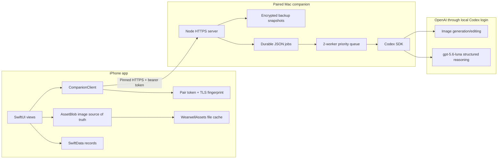
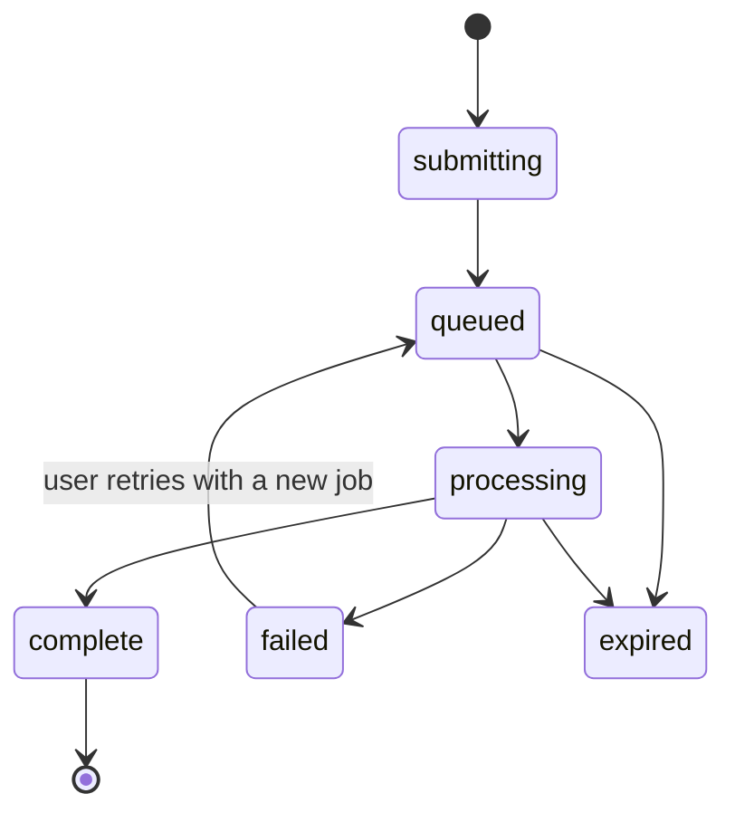
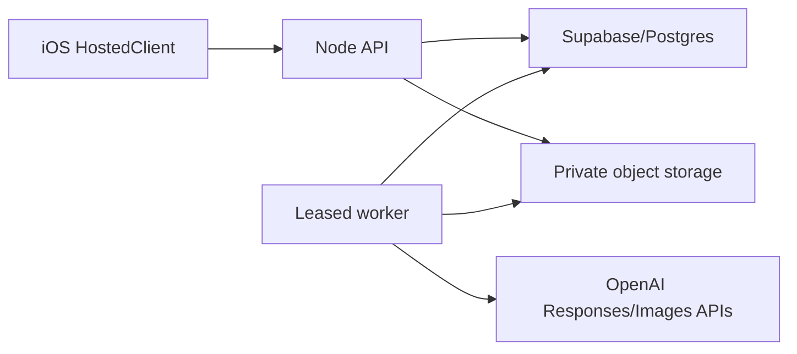

# Wearwell: Living Technical Guide Across Branches

**Status:** Living engineering document  
**Last audited:** 2026-08-05  
**Primary branch:** `codex/local-device` / `codex/personal-local`  
**Audience:** A new-grad engineer preparing for backend, retrieval, applied-ML, and production AI work

This document explains the system as it exists, why it was designed this way, and how the branches differ. Update it in the same change as any architecture, persistence, API, model, or workflow change.

The team-match PDF influenced the teaching emphasis here: backend boundaries, retrieval/ranking, durable work, model orchestration, and production reliability. It is not copied into this repository, and this document contains no recruiting-form answers.

## 1. Which branches matter

| Branch | Purpose | Runtime shape | Status |
| --- | --- | --- | --- |
| `codex/cloud-capabilities` | Original full iOS product with private iCloud/CloudKit persistence | iPhone + CloudKit + paired Mac companion | Historical baseline |
| `codex/local-device` | Personal-development version that can be signed and run without paid cloud capabilities | iPhone local storage + paired Mac companion + local Codex login | Main tested architecture |
| `codex/personal-local` | Alias/checkpoint of the same commit as `local-device` | Same as local-device | No independent architecture delta today |
| `codex/personal-local-ecommerce` | Current experimental working tree adding shopping-oriented concepts | Local architecture plus unfinished shopping discovery | In progress and uncommitted |
| `codex/hosted-multiuser` | Migration from one user's Mac to a deployable multi-user service | iPhone + hosted API + Postgres/Supabase + object storage + worker + OpenAI API | Migration branch |
| `master` / `origin/main` | Repository starting points | Minimal/earlier project state | Not a current product architecture |

`codex/persisted-storage` is intentionally excluded at the user's request.

The local branch gets the deepest explanation because it is the version that has actually been exercised. Later chapters explain other branches as deltas: what changed and why.

## 2. Local-device architecture in one picture



The core design idea is separation of responsibility:

- The iPhone owns user interaction and durable product state.
- The Mac owns expensive model execution and temporary job state.
- Codex supplies authenticated model access using the Mac user's existing login.
- Deterministic Swift and JavaScript validate model output before it becomes product data.

This is a strong prototype/personal-product design because no OpenAI API key is embedded in the app. Its main limitation is availability: AI features require that particular Mac to be awake and reachable.

## 3. Repository map for the local branch

| Path | Responsibility |
| --- | --- |
| `Wearwell/WearwellApp.swift` | SwiftData schema, container, dependency construction, app lifecycle |
| `Wearwell/Models/Models.swift` | Durable domain records and network result DTOs |
| `Wearwell/Services/AssetStore.swift` | Image persistence, file cache, cutouts, background cleanup, deterministic outfit validation |
| `Wearwell/Services/CompanionClient.swift` | Discovery, pairing, TLS pinning, authenticated requests, request-size budgets |
| `Wearwell/Services/BackupService.swift` | Versioned export/restore and Mac backup manifest generation |
| `Wearwell/Services/MacBackupController.swift` | Automatic daily incremental backup coordination |
| `Wearwell/Services/StylePreferenceCache.swift` | Style-vector aggregation and relevant-look retrieval |
| `Wearwell/Services/OutfitFeedbackStore.swift` | Loved/disliked combinations and edit history |
| `Wearwell/Views/` | Feature state machines and SwiftUI presentation |
| `Companion/server.mjs` | Local HTTPS API, durable job orchestration, Codex calls |
| `Companion/backup-store.mjs` | Encrypted content-addressed blobs and retained snapshots |
| `Companion/outfit-rules.mjs` | Server-side outfit composition invariant |
| `Companion/response-schemas.mjs` | JSON schemas constraining model output |
| `Companion/tests/` | Contract and pure-logic regression tests |

## 4. iOS startup and dependency graph

`WearwellApp` creates a disk-backed `ModelContainer`. On the local branch, `cloudKitDatabase: .none` is deliberate: records do not require CloudKit entitlements or a paid Apple Developer configuration.

The app constructs three shared stateful services:

1. `CompanionClient` manages connection/authentication state.
2. `DataProtectionController` configures `AssetStore`, migrates old image files into SwiftData, and exposes recovery status.
3. `MacBackupController` decides when a backup is due and coordinates it.

These are injected as SwiftUI environment objects. This avoids manually passing them through every initializer, but it also means a view that requires one must be hosted below the root injection point.

At launch, the app:

- opens or migrates the SwiftData store;
- configures the image store with the model container;
- hydrates missing cache files from `AssetBlob` records;
- discovers the companion over Bonjour;
- checks companion health if credentials exist;
- revisits interrupted imports, style jobs, purchase assessments, and backups.

The lifecycle matters because mobile apps are suspended frequently. A long AI request cannot be treated like an ordinary button callback.

## 5. Persistence: database records versus image bytes

### 5.1 SwiftData as the local database

SwiftData is an object graph persisted on disk. `@Model` classes are analogous to database tables, although the API exposes Swift objects rather than rows.

Important models include:

- `Garment`: confirmed wardrobe item, observed evidence, uncertainty, source and catalog images.
- `WishlistItem`: prospective purchase and its latest assessment.
- `Outfit`: title, rationale, origin, and editable collage layout.
- `Visualization`: generated mannequin or on-person rendering.
- `ReferencePhoto`: reference used for visualization.
- `ImportDraft`: durable client-side state machine for an unfinished clothing import.
- `InspirationLook`: an inspiration image and structured analysis.
- `StyleProfile`: cached aggregate of all ready inspiration analyses.
- `StyleGeneration`: durable client-side state for outfit-generation work.
- `AssetBlob`: the durable bytes for an image.

### 5.2 Why some values are JSON blobs

Variable-length nested values such as collage layout, analyses, and suggestions are encoded into `Data` fields. This keeps SwiftData models simple and makes the wire format reusable. The tradeoff is weaker queryability: the database cannot efficiently ask for every outfit containing a particular trait inside opaque JSON.

For a small personal library that is acceptable. In a large server database, normalized columns or indexed JSONB would be considered when query patterns become important.

### 5.3 Image persistence uses two layers

`AssetBlob` is the durable source of truth. Its bytes use SwiftData external storage so the database can keep large binary values outside ordinary row storage.

`Application Support/WearwellAssets` is a rebuildable file cache. SwiftUI and UIKit can synchronously load a file path quickly. If the file is missing, `AssetStore.data(named:)` loads the blob and rematerializes the file.

This is a common systems pattern:

```text
durable canonical representation -> disposable optimized cache -> UI
```

The design avoids putting raw image bytes in every record and avoids making every render perform a database fetch. It also introduces an invariant: deleting or replacing an asset must update both the blob and the file cache.

### 5.4 Data protection and migration

New image files are written atomically with complete file protection. `DataProtectionController` scans legacy cache files and inserts missing `AssetBlob` rows without deleting the legacy files. That migration is additive, which reduces the chance of losing a user's only copy.

There is also orphan recovery: unreferenced PNG blobs can be reconstructed into placeholder garments for manual review. Recovery favors preserving data over silently deleting suspicious records.

## 6. Pairing and “logging in through Codex”

There are two distinct authentication relationships. Keeping them separate is essential.

### 6.1 Mac to OpenAI: `codex login`

The user runs `codex login` on the Mac and chooses ChatGPT sign-in. Codex stores its own authentication material under the user's Codex home. The Node companion uses `@openai/codex-sdk`; it does not receive an OpenAI API key from the phone.

The companion creates two isolated worker Codex homes and copies `auth.json` into each with mode `0600`. Each worker then starts SDK threads with:

- model `gpt-5.6-luna`;
- medium reasoning;
- fast service tier;
- no approval prompts;
- network and web search disabled;
- the repository as working directory.

Isolation is important for generated images. Separate output directories prevent one concurrent job from accidentally collecting another job's artifact.

### 6.2 Phone to Mac: pairing

On every companion start, the server prints a random six-digit code. It also advertises `_wearwell._tcp` using Bonjour. The phone can discover a `.local` hostname or accept a manually configured hostname/IP.

The companion creates a long-lived self-signed TLS certificate. During first pairing, the phone temporarily allows first trust, sends the code, and records:

- a random bearer token issued by the companion;
- the observed SHA-256 certificate fingerprint.

Both are stored in the iOS Keychain. Future sessions require the bearer token and exact certificate fingerprint. This is certificate pinning: encryption alone is insufficient if the client would trust any self-signed certificate.

The pairing code is bootstrap proof, the bearer token is ongoing application authorization, and the pinned certificate authenticates the transport endpoint. They solve different problems.

### 6.3 Server token handling

Paired device tokens are stored in `Companion/data/paired-devices.json` with restrictive permissions. Authorization compares tokens using a timing-safe operation. Jobs and backups store only a SHA-256 owner hash, preventing one paired device from reading another device's jobs by guessing an ID.

This is appropriate for a trusted personal Mac, not a complete internet-facing identity system. There is no account recovery, refresh-token protocol, administrative revocation UI, multi-tenant database, or rate-limit layer.

## 7. The local HTTPS API

The important endpoint families are:

| Endpoint | Purpose |
| --- | --- |
| `POST /v1/pair` | Exchange the six-digit code for a device token |
| `GET /v1/health` | Verify auth, model, service tier, and availability |
| `POST /v1/jobs/analyze` | Queue durable garment analysis/cutout work |
| `POST /v1/jobs/style` | Queue durable outfit generation and critic ranking |
| `POST /v1/jobs/assess` | Queue a wishlist purchase assessment |
| `POST /v1/jobs/catalog/edit` | Queue a natural-language catalog-image edit |
| `GET/DELETE /v1/jobs/:id` | Poll or cancel owned durable work |
| `POST /v1/inspiration/analyze` | Analyze one inspiration image |
| `POST /v1/recommend-item` | Select one owned piece for a collage |
| `POST /v1/render` | Generate mannequin/on-person visualization |
| `POST /v1/backups/*` | Incremental encrypted Mac backups |

Requests are JSON and images are base64-encoded. This keeps the protocol simple, but base64 expands data by roughly one third and forces request bodies into memory. The server therefore enforces body and per-image limits, while the phone creates compressed visual references and byte budgets.

## 8. Durable jobs and mobile reliability

Garment analysis, styling, assessment, and catalog edits can outlive a foreground app session. The companion writes each job as a JSON file using temporary-file-plus-rename atomic replacement.

The state machine is approximately:



The phone separately persists the remote job ID and visible state in `ImportDraft`, `StyleGeneration`, `WishlistItem`, or garment regeneration fields. When the app becomes active, it polls the companion and reconciles local state.

The companion uses two workers. A priority queue assigns a stable worker slot. Queued/processing jobs found after a server restart are reset to queued and resumed in original creation order. A one-hour processing timeout aborts pathological work, and jobs that wait too long expire.

Why persist on both sides? The Mac needs enough data to finish while the phone sleeps; the phone needs enough data to recover its UI after termination. This is a small distributed system even though both devices belong to one person.

A production upgrade would add idempotency keys, leases/heartbeats, explicit retry counts, structured error codes, and better cleanup semantics. The hosted branch does exactly that.

## 9. Garment ingestion pipeline

The end-to-end path is:

1. User selects, photographs, pastes, shares, or imports image data.
2. The phone immediately saves source bytes and creates an `ImportDraft`.
3. Multiple selected photos can mean separate items or several views of one item.
4. The phone submits a durable analysis job.
5. The server writes temporary files and asks Luna for structured inventory JSON using `inventorySchema`.
6. The schema limits categories, subcategories, confidence, observed evidence, unknowns, and fingerprint.
7. Items with confidence at least 0.45 receive a generated catalog cutout attempt.
8. A failed image-generation turn falls back to the source image instead of failing the whole import.
9. The phone decodes the result and presents human review.
10. Only confirmed items become `Garment` records.

Human confirmation is a product and safety boundary. The model may identify several garments, misunderstand a category, or hallucinate a detail. The database should not treat inference as user-confirmed truth.

The catalog cutout is a presentation asset, not factual evidence. Wearwell retains the original photo, the observed description, unknowns, confidence, model version, and prompt version so later code can reason about provenance.

## 10. Style “embeddings” precisely explained

Wearwell does not currently use a learned embedding model or vector database. Its style vector is a fixed, interpretable 12-dimensional feature vector:

```text
minimal, maximal, relaxed, tailored,
romantic, edgy, sporty, vintage,
classic, experimental, layered, colorful
```

Each inspiration image is analyzed into:

- a summary;
- categorical traits such as palette and silhouettes;
- outfit formula, proportions, focal points, and reusable styling rules;
- the 12 scores from 0 to 1.

`StylePreferenceCache.refresh` computes a weighted mean. Normal looks have weight 1; favorites have weight 2. It also builds frequency-ranked text traits. A signature containing look IDs, update times, and favorite flags avoids recomputing an unchanged profile.

This is similar to an embedding because it maps a complex object into numbers, but it is hand-defined and semantically named. A learned embedding is normally high-dimensional, opaque, produced by a trained model, and compared using cosine/dot-product distance.

### Retrieval of relevant inspiration

Relevant looks are selected with lexical token overlap against the request, with favorites and recency as tie-breakers. This is lightweight retrieval, not semantic nearest-neighbor search.

That distinction is useful at work:

- Aggregation answers “what are the user's recurring preferences?”
- Retrieval answers “which specific examples matter for this request?”
- Ranking answers “which candidate outputs are best?”

The code uses all three. A future retrieval system could replace token overlap with embeddings while preserving the same interface and evaluation questions.

## 11. Outfit generation: generator, critic, and validators

Outfit generation is deliberately multi-stage.

### 11.1 Context construction

The phone sends wardrobe metadata, compressed garment images, the aggregate style profile, relevant inspiration examples/images, recent generations, direct feedback, saved outfits, and edit pairs. Arrays and image bytes are capped to control latency and context size.

### 11.2 Candidate generator

Luna creates 10-12 candidate combinations. The prompt asks for inspiration translation, diversity, restraint, an optional anchor, and explicit layering. This stage explores a broad candidate space.

### 11.3 Deterministic filtering

JavaScript rejects:

- unknown or repeated garment IDs;
- duplicate combinations;
- exact disliked combinations;
- candidates that omit a requested anchor;
- multiple bottoms/dresses or too many torso pieces;
- ambiguous two-piece torso layering.

This matters because prompt instructions are probabilistic. Invariants that can be expressed in code should be enforced in code.

### 11.4 Visual critic

The companion assembles actual garment cutouts into candidate boards using Sharp. A second model pass sees those boards, inspiration images, and saved positive outfits, then selects exactly three candidates. The critic may rank but may not alter IDs or layering.

Generator-plus-critic separates recall from precision. The generator searches; the critic compares. This is analogous to retrieval systems that first produce candidates cheaply and then rerank them with a more expensive model.

### 11.5 Client validation

The iPhone validates returned IDs and composition again. Duplicated validation protects the app from server bugs, version skew, and malformed responses. Server validation protects every client; client validation protects the local database and UI.

## 12. Feedback and personalization

There are four feedback signals:

- loved/disliked generated combinations, with targeted dislike reasons;
- intentionally saved outfits;
- edits from a generated outfit's original layout to the user's final layout;
- inspiration favorites, which double their aggregate weight.

Recent generations are explicitly treated as repetition history, not positive feedback. This prevents a feedback loop where the system repeatedly recommends something merely because it recommended it before.

`OutfitFeedbackStore` currently uses `UserDefaults`. That is convenient for a small personal feature, but it is less durable and queryable than SwiftData and is not included in the documented backup manifest. Moving it into a versioned persisted model would be a reasonable hardening task.

## 13. Wishlist assessment and visualization

“Should I Buy This?” compares one candidate with confirmed garments, style profile, relevant inspiration, and compressed images. The model returns a buy/maybe/skip verdict and several outfits using owned IDs; the candidate is added locally to each collage. Composition is validated server-side and client-side.

Mannequin and “on me” rendering are image-generation approximations. They are useful ideation, not evidence of fit, drape, opacity, size, or product accuracy. The product preserves that epistemic boundary in its copy and architecture.

## 14. Backups on the local branch

### 14.1 Portable backup package

`BackupService` creates a versioned `.wearwellbackup` package containing `manifest.json` plus an `assets` directory. Every asset records byte count and SHA-256. Restore validates names, sizes, hashes, JSON fields, and the format version before modifying the context.

Restore is non-destructive/upsert-oriented: records with matching UUIDs are updated, missing records are inserted, and unrelated local records are retained. Database save happens before cache hydration.

### 14.2 Automatic Mac snapshots

Once per day by default, the phone builds a manifest first. The Mac reports which content hashes are missing, so the phone uploads only unique absent images. This is content-addressed deduplication.

The Mac derives an AES-256-GCM key from the pairing token, encrypts blobs and manifests with random nonces, and namespaces them by owner hash. GCM provides confidentiality and tamper detection.

Retention keeps up to 14 distinct daily points and 12 weekly points. Unreferenced blobs are pruned only after retained snapshots are readable.

One limitation: encryption derived solely from the pairing token means losing/revoking that token can make old snapshots unrecoverable. The current server exposes status/commit but no complete restore-download UI. This is backup infrastructure that still needs a tested disaster-recovery product flow.

## 15. Security and privacy boundaries

Good local-branch controls include:

- no OpenAI API key in the iOS binary;
- explicit user-selected images only;
- HTTPS plus certificate pinning;
- bearer tokens and fingerprints in Keychain;
- timing-safe token comparison;
- owner-scoped jobs/backups;
- file protection and restrictive Mac permissions;
- request/image size limits;
- temporary image cleanup;
- network/web search disabled for ordinary Codex model threads;
- structured schema plus deterministic validation.

Important limitations include:

- the companion binds to all interfaces on the local network;
- the six-digit pairing code has no explicit attempt rate limit;
- paired-device tokens lack an expiry/rotation protocol;
- JSON file persistence is not transactional across multiple files;
- operational logs and metrics are minimal;
- the personal Mac remains a single point of failure and availability.

## 16. Testing, debugging, and observability

Node tests focus on pure contracts: schemas, category normalization, outfit composition, queues, timeouts, item eligibility, encryption, retention, and backup validation. Swift tests cover layout, style aggregation, validators, model behavior, and service helpers.

Pure functions are intentionally extracted from the server because importing `server.mjs` starts listeners and requires Codex state. Isolating rules makes tests fast and deterministic.

Current observability is mostly console output plus user-visible job state. At production scale, add structured logs with job/request IDs, latency histograms by stage, retry/error classification, queue depth, token/image usage, and alerts. Never log bearer tokens, source images, backup keys, or full personal prompts.

## 17. Cloud-capabilities branch: what changes

`codex/cloud-capabilities` is the original broad product baseline. Its largest architectural difference is persistence configuration:

- SwiftData records and `AssetBlob`s target a private CloudKit database.
- CloudKit/push/background entitlements are enabled.
- a Share Extension writes through an App Group handoff.
- the app must be signed with identifiers and containers configured in the Apple Developer portal.

The companion AI architecture remains local. Therefore “cloud-capabilities” means Apple-managed synchronization of user data, not hosted AI execution.

Why use CloudKit? It offers private per-iCloud-account data and Apple-native sync without operating a custom account/database service. Why remove it for local-device? Personal signing teams and physical-device development often cannot provision the required containers and restricted entitlements reliably.

CloudKit also constrains schema evolution. Production schemas are additive, so model changes should use a new `VersionedSchema` and migration stage. Sync conflict behavior, account availability, eventual consistency, and large-asset performance become part of the product.

## 18. Local-device branch: changes from cloud-capabilities

The local branch disables CloudKit, App Groups, push/background remote notification, and share-extension capabilities that require broader provisioning. It retains local SwiftData, file/blob persistence, export/restore, and the paired Mac.

It also substantially deepens product behavior beyond the original branch:

- durable analysis/style/assessment/catalog-edit jobs;
- two isolated Codex workers;
- encrypted incremental Mac backups;
- better cutout/refinement and cache recovery;
- multi-photo same-item analysis and garment regeneration;
- richer subcategories;
- style analysis v2 and aggregate profile;
- generator-plus-visual-critic outfit ranking;
- outfit feedback, saved-example, and edit signals;
- stricter layering/composition validation.

This branch is the best learning target because it contains real distributed-state and applied-model problems without the operational surface area of a hosted service.

## 19. Hosted-multiuser branch: what changes

The hosted branch replaces the Mac companion and Codex login with centrally operated services:



Major replacements are:

| Local concept | Hosted equivalent |
| --- | --- |
| Six-digit Mac pairing | Sign in with Apple/email magic link plus invitation gate |
| Keychain pair token | Keychain access/refresh session tokens |
| Local HTTPS certificate pin | Public TLS and JWT verification |
| JSON job files | PostgreSQL jobs with idempotency, leases, heartbeats, attempts |
| Mac filesystem backup blobs | Private object storage and backup import/export |
| Codex SDK using `auth.json` | Server-side OpenAI API key |
| Process-local priority queue | Database-backed worker claiming |
| One owner's local files | User IDs, row-level security, quotas, account deletion |

The API and worker are separate processes. The API validates identity, creates short requests/jobs, and returns quickly. The worker claims a job with a time-limited lease, heartbeats while processing, retries transient failures, and records results/usage. This is more resilient to process restarts and horizontal scaling.

Postgres stores profiles, invitations, sessions/jobs/usage, and generic JSONB domain records. Revisions support optimistic concurrency; soft-deletion/change logs support synchronization; row-level security adds defense in depth. Signed object-storage URLs keep large image transfers away from the API process.

The hosted branch has its own much more detailed 939-line `TECHNICAL_DESIGN.md` at commit `03d841d`. Its migration is explicitly incomplete: some server-side sync and lifecycle pieces exist before all iOS paths are wired. Treat it as a migration design, not proof that every end-to-end flow is production-ready.

## 20. Personal-local-ecommerce working tree

This is not yet an independent committed architecture. It starts from `personal-local` and currently contains experimental changes.

Implemented/in-progress concepts include:

- `ShoppingProfileDTO` and a SwiftData `ShoppingProfile` for country, currency, sizes, budgets, preferred/custom retailers, and exclusions;
- `ShopFeedSnapshot` for cached products, dismissals, expiry, and job/error state;
- explicit SwiftData schema V2 with a lightweight migration from V1;
- retailer-domain normalization;
- product-page verification through JSON-LD, Open Graph, canonical URLs, and price metadata;
- public-HTTPS and DNS checks intended to reduce server-side request forgery risk;
- response-size, content-type, and redirect limits;
- a more general “Ask Luna” collage recommendation picker for any category/subcategory.

The shopping discovery module is technically interesting because model discovery must not be trusted as product truth. A safe pipeline should use a model/search mechanism to propose URLs, then deterministic fetch/parsing code to verify canonical URL, retailer allowlist, image, price, currency, and freshness.

This branch is unfinished: shopping models and discovery helpers are present, but the full user-facing feed, durable shop jobs, model discovery integration, and end-to-end validation are not all wired. Because the changes are uncommitted, this chapter should be updated frequently and should not describe them as shipped.

## 21. Why the designs evolved

The branch history is an architecture progression:

```text
CloudKit product baseline
        |
        v
local-device simplification for installability
        |
        +--> deeper personal AI workflows and reliability
        |
        +--> hosted multi-user migration for availability and scale
        |
        +--> ecommerce experiment for external product discovery
```

Each step changes who operates the system:

- CloudKit delegates account sync to Apple.
- Local-device delegates AI authentication and compute to the user's Mac/Codex session.
- Hosted multi-user makes the product team own identity, database, storage, queues, secrets, quotas, and incidents.
- Ecommerce introduces untrusted external websites, verification freshness, SSRF defenses, retailer policy, and price correctness.

Architecture is not simply “more scalable is better.” The right shape depends on user count, installability, privacy, cost, reliability target, and how much operational burden the team can own.

## 22. Concepts to know for work

Use this codebase to practice explaining:

1. **State ownership:** Which process is authoritative for records, images, jobs, and credentials?
2. **At-least-once behavior:** What happens if a request succeeds but its response is lost?
3. **Idempotency:** Can retrying create duplicate jobs, uploads, or records?
4. **Optimistic concurrency:** How are conflicting edits detected rather than silently overwritten?
5. **Leases and heartbeats:** How does another worker safely recover abandoned work?
6. **Structured outputs:** What belongs in a prompt/schema versus deterministic validation?
7. **Retrieval and reranking:** How are relevant examples/candidates selected, then ranked?
8. **Evaluation:** How would you measure style relevance, validity, diversity, latency, and user satisfaction?
9. **Security boundaries:** Which inputs are untrusted, where are secrets held, and what can access private data?
10. **Observability:** How would you debug one failed job without exposing user content?

## 23. Known issues and honest limitations

- README text spans multiple historical architectures and can be misleading unless read with the active branch.
- Local AI depends on one awake/reachable Mac.
- Local job files and token files are pragmatic, not a transactional database.
- Retry/idempotency semantics are weaker locally than on the hosted branch.
- Backup restore from retained Mac snapshots is not a complete user-facing disaster-recovery flow.
- Feedback in `UserDefaults` is outside the main versioned database/backup model.
- Style relevance uses lexical overlap, not semantic retrieval.
- Model quality claims need an evaluation set rather than prompt intuition alone.
- The ecommerce working tree is incomplete and uncommitted.
- Branch aliases (`personal-local` and `local-device`) currently point to the same commit, which can confuse ownership unless their intended roles are documented.

## 24. Suggested code-reading order

For the local system:

1. `Wearwell/WearwellApp.swift`
2. `Wearwell/Models/Models.swift`
3. `Wearwell/Services/AssetStore.swift`
4. `Wearwell/Services/CompanionClient.swift`
5. `Companion/server.mjs`, reading pairing, jobs, Codex adapters, and workflows separately
6. `Wearwell/Views/AddClothesView.swift`
7. `Wearwell/Services/StylePreferenceCache.swift`
8. the `style()` generator/critic workflow in `Companion/server.mjs`
9. `Wearwell/Services/BackupService.swift` and `Companion/backup-store.mjs`
10. tests beside each pure rule

For hosted production concepts, then read `Backend/server.mjs`, `Backend/worker.mjs`, the SQL migrations, storage/auth adapters, and `HostedClient.swift` in `codex/hosted-multiuser`.

## 25. Update checklist

When product code changes, update this document if any answer changes:

- What runs on the phone, Mac, or hosted service?
- What is the source of truth for each data type?
- How does authentication bootstrap, refresh, revoke, and expire?
- Which work survives suspension, restart, retry, and duplicate submission?
- Which model, prompt, schema, and deterministic validator are used?
- What user data crosses each boundary?
- What is cached, retained, encrypted, or deleted?
- Which branch contains the feature, and is it committed, tested, and wired end to end?

## 26. Architecture decision log

### Local SwiftData rather than mandatory CloudKit

Chosen to make personal physical-device development and signing reliable. Cost: no automatic cross-device synchronization.

### Paired Mac and Codex login rather than an embedded API key

Chosen to keep secrets out of the phone and reuse the user's existing local authentication. Cost: Mac availability and a custom local trust protocol.

### Durable jobs rather than long synchronous mobile requests

Chosen because iOS suspension and model latency are normal. Cost: state reconciliation, expiration, polling, and cleanup complexity.

### Interpretable style vector rather than opaque learned embeddings

Chosen for debuggability and small-data behavior. Cost: lower semantic expressiveness and hand-designed dimensions.

### Generator plus critic rather than a single style call

Chosen to separate candidate recall from visual ranking. Cost: additional latency and model usage.

### Hosted API plus worker for multi-user operation

Chosen so clients do not depend on a personal Mac and work survives service process turnover. Cost: substantial operational, security, database, and observability responsibility.

### Deterministic retailer verification for ecommerce

Chosen because model-proposed product facts and URLs are not trustworthy enough for prices or navigation. Cost: retailer-specific variability, parsing maintenance, and explicit SSRF/freshness handling.
